# TASK-WORKSPACE-GAUGE — fuel gauge + Agents/Reports/Rules merge

ui-agent · WORKSPACE seam · 2026-07-20 (drive ran into the early hours of 07-21)

Both parts shipped. Three local commits, nothing pushed, tree clean on my seam.
Screenshots in `docs/reports/assets/2026-07-20-workspace-gauge/`.

Two premise corrections and one deliberate deviation from the brief are below,
under **Flags** — read those before the verification table.

---

## Commits

| Commit | What |
| --- | --- |
| `6adaf6a` | Part 1 — the three-card fuel gauge, its server loader and read-only route |
| `e37bf63` | Part 2 — the three sections merged into one tabbed section; six files deleted, two added |
| `c24cf4f` | Follow-up — drop the live/modeled chip when there is no reading (found during empty-state verification) |

Files added: `lib/workspace-usage.ts`, `app/api/workspace/usage/route.ts`,
`app/(app)/workspace/usage-gauge.tsx`, `app/(app)/workspace/workbench.tsx`,
`app/(app)/workspace/workbench-grid.tsx`,
`app/api/insights/report/[date]/route.ts`.

Files deleted: `fleet.tsx`, `fleet-grid.tsx`, `agent-card.tsx`,
`rules-panel.tsx`, `rules-grid.tsx`, `night-report.tsx` — all six were the three
near-identical grids the merge collapses into one.

Files modified: `page.tsx`, `lib/repos/lead-reports.ts`, `lib/rules.ts`.

---

## Part 1 — the fuel gauge

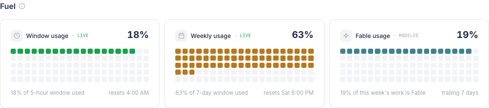

Three cards, placed immediately above "Coverage & growth" under the heading
**Fuel**. Each carries the identity icon + label top-left, the percentage
top-right, a grid of small rounded squares (one square = one whole percent, so
the grid *is* the reading), and a two-item footer. *(Batch 2 below re-proportions
this grid to 25 × 4 and swaps the per-card icons for the Claude mark — the
screenshots in this section predate that.)*

**Colour** comes from `docs/ops/PACING.md`'s own bands, on existing theme tokens
— `bg-success` under 60%, `bg-warning` 60–85%, `bg-danger` above, `bg-canvas`
for the unfilled track. No new palette. The fill animates from zero on mount and
is held at its final value under `prefers-reduced-motion` (verified — see below).

### What each card actually shows, and where the number comes from

**Card 1 · Window usage — LIVE.** `rate_limits.five_hour.used_percentage` from
`~/.claude/hq/statusline-snapshot.json`, verbatim. Footer-right is
`resets_at` × 1000 rendered as a clock; the file stores unix **seconds**, and
the conversion is at `lib/workspace-usage.ts:75`.

**Card 2 · Weekly usage — LIVE.** `rate_limits.seven_day`, same treatment, with
a weekday on the reset because a seven-day window doesn't reset today. The two
windows are **not** mixed: five-hour → the session card, seven-day → the week
card, mapped explicitly in `usageGauge()`.

**Card 3 · Fable usage — MODELED.** This is the one that needs a plain
statement, so here it is:

> The card shows **Fable's share of the trailing week's weighted work — 19% at
> the time of writing — derived, not measured.** It is not a percentage of any
> cap, and it is not what `/usage` would call "Current week (Fable)".

The derivation mirrors `~/Code/hq/lib/usage.ts` step for step:

1. Walk `~/.claude/projects/**/*.jsonl` for files touched in the trailing 7 days.
2. Keep one record per `requestId ?? message.id` — Claude Code writes a message's
   usage block several times while streaming, so summing every line triple-counts.
3. Weight the token shape: fresh input ×1, cache write ×1.25, cache read ×0.1,
   output ×5.
4. Weight again by model tier (`MODEL_WEIGHT`): opus 5.0, fable 5.0, mythos 5.0,
   sonnet 1.0, haiku 0.33.
5. Fable's weighted total ÷ everything's weighted total.

hq's caveat is carried across verbatim in spirit, in the code comment and in the
card's tooltip: **the tier multiplier is a calibration knob, not a measured
constant, and Fable's 5.0 is a placeholder** until a Fable-heavy block is
measured. The card wears a `· modeled` label; cards 1 and 2 wear `· live`.

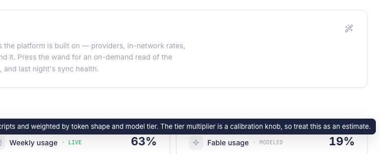

I cross-checked the derivation against an independent throwaway script before
building anything: it returned Opus 80.3% / Fable 19.6% / Sonnet 0.1% over 70
files and 7,861 deduped records. The route returned 19.45% an hour later. The
two agree.

### Reading is server-side only

`~/.claude` is never touched from a browser. `lib/workspace-usage.ts` is a
server module; `/api/workspace/usage` is `requireRole("admin")` and returns
**rendered readings only** — never the raw snapshot, never a transcript line.
Unauthenticated it returns 401 (verified below).

The cold transcript walk costs ~1.6s over ~390MB, so files are cached by byte
offset exactly as hq does and only appended bytes are re-parsed. The gauge is
fetched from the client on mount rather than awaited during page render, so even
the cold walk never blocks `/workspace`. It re-polls once a minute.

---

## Part 2 — Agents, Reports, and Rules

| Agents | Reports | Rules |
| --- | --- | --- |
| 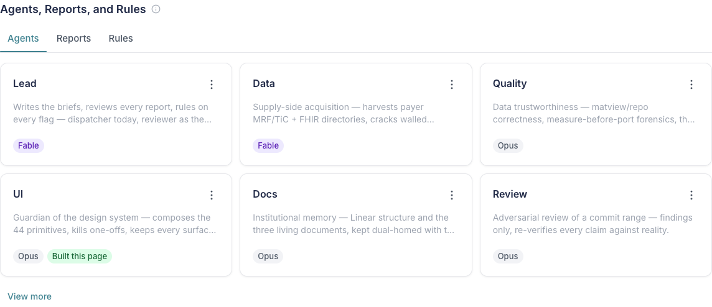 | 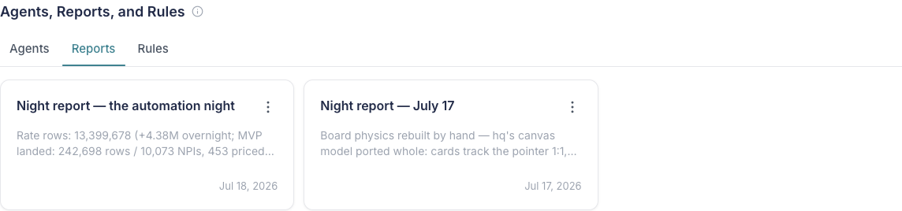 | 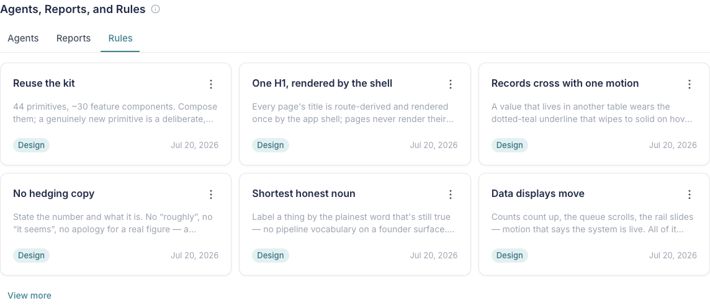 |

Three sections became one section with three tabs — and, more to the point,
three near-identical grids became **one** component. "The night's work", the
fleet roster and the rules grid were all the same gesture (a markdown document
you open and edit), so `workbench-grid.tsx` renders one card type and a tab only
changes which documents it lists. That is why six files were deleted for two.

- **Reports tab** — every `lead_reports` row, newest first. I added
  `listLeadReports()` and `leadReport(date)` to `lib/repos/lead-reports.ts`
  (only `latestLeadReport()`/`LIMIT 1` existed), both `hasDb ? sql : []`, dates
  out as ISO strings through the existing `toReport()` normalizer I factored out
  of the old function. A new per-date endpoint
  `app/api/insights/report/[date]/route.ts` backs each card's DocSheet; the
  sibling route only served the latest. The sheet chrome reads **"Report"**.
- **Rules tab** — Design/Agent/Database collapsed into one list, each card
  carrying its family as a badge in the lower-left (teal / violet / blue).
  `RULE_TABS` became `RULE_CATEGORY` in `lib/rules.ts`.
- **Agents tab** — unchanged in content; the roster moved into `workbench.tsx`.
- **Every card** is a `LibraryCard` — fixed 166px height, `line-clamp-2` body,
  kebab top-right with "Copy as Markdown", whole card clickable.
- **The "Editable" badge is gone.** It lived at the old `night-report.tsx:36`;
  that file no longer exists. Zero survive anywhere on the page (asserted in the
  drive, not eyeballed).

### The component I reused for the card → document gesture

**`app/(app)/workspace/doc-sheet.tsx`, unchanged and unforked.** All three tabs
pass it an `endpoint` and a `label`; it already implemented the GET
`{title, subtitle, bodyMd}` / PATCH `{bodyMd}` contract, the editor, Save, and
its own "Copy as Markdown". Its diff in this tranche is zero lines.

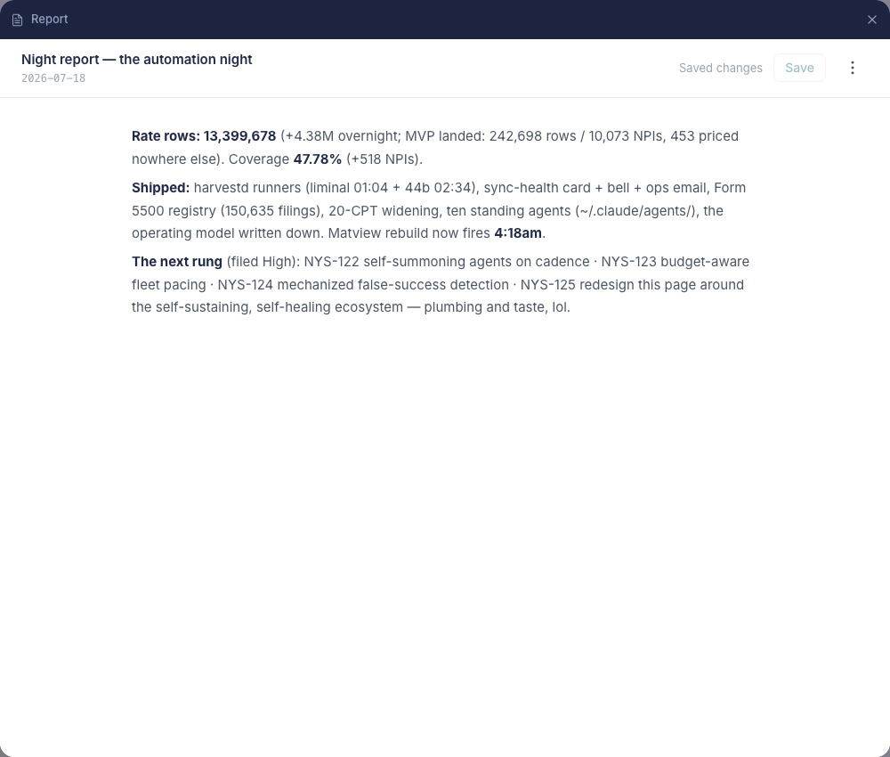

---

## Verification

Headless Chromium, real login as `brendan@liminal.demo` (admin role — the whole
ecosystem column is admin-gated), against the running dev server on :3010. Every
row below is an assertion the drive printed, not an impression.

| Claim | Evidence | 1440 | 1280 |
| --- | --- | --- | --- |
| Gauge renders three cards | `GAUGE CARDS 3` | ✅ | ✅ |
| Gauge sits immediately above "Coverage & growth" | `H2 ORDER ["Summary","Fuel","Coverage & growth","Operations","Agents, Reports, and Rules","Data"]` | ✅ | ✅ |
| Agents tab = 3×2 + View more | `cards=6 viewMore=1` | ✅ | ✅ |
| Rules tab = 3×2 + View more | `cards=6 viewMore=1` | ✅ | ✅ |
| Reports tab = every row, newest first | `cards=2 viewMore=0` — **the database holds 2 rows**, see Flags | ✅ | ✅ |
| All cards in a tab equal height | `heights=[166]` (a one-element set of distinct heights) on all three tabs | ✅ | ✅ |
| Every card has the kebab | `kebabs=6 / 2 / 6`, one per card | ✅ | ✅ |
| Zero "Editable" badges | `EDITABLE_BADGES 0` (counts leaf nodes whose text is exactly "Editable") | ✅ | ✅ |
| A card click opens the DocSheet | `DOCSHEET: rise=1 saveBtn=1 label=true`, plus its innerText read back the report title, subtitle and body | ✅ | ✅ |
| No horizontal overflow | `docScroll: false` | ✅ | ✅ |
| One H1, from the shell | `H1S ["Workspace"]` | ✅ | ✅ |

**Route behaviour**, checked directly:

| Request | Result |
| --- | --- |
| `GET /api/workspace/usage` (admin) | 200, three rendered cards |
| `GET /api/workspace/usage` (no cookie) | 401 |
| `GET /api/insights/report/2026-07-17` | 200 |
| `GET /api/insights/report/2026-07-17` (no cookie) | 401 |
| `GET /api/insights/report/notadate` | 400 |
| `GET /api/insights/report/1999-01-01` | 404 |
| `PATCH` with no `bodyMd` | 400 |
| `PATCH` with the body round-tripped unchanged | 200, and a re-GET returned the same 5,671 characters |

**Empty state.** I did not assert this one — I forced it. Pointing
`CLAUDE_HOME` at a directory that does not exist and letting HMR pick it up, all
three cards fall back to an em-dash, an empty grid and a plain reason. This is
also how I caught the chip bug fixed in `c24cf4f`: before the fix, cards 1 and 2
still displayed a green `LIVE` chip over the em-dash, claiming a measurement they
were simultaneously saying they didn't have.

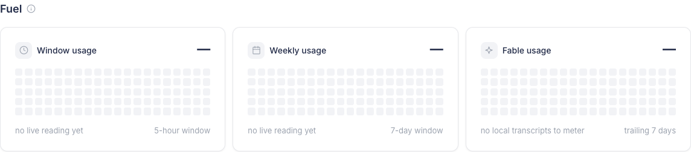

**Reduced motion.** Driven with `reducedMotion: "reduce"`: the cards render at
their final values (18% / 63% / 19%) rather than sticking at zero.

`npx tsc --noEmit` is clean.

---

## Flags

**1. Premise correction — "3×2 then View more" cannot be shown on the Reports
tab, because `lead_reports` has two rows.** The brief's verification asks for
"exactly 3×2 plus View more" on every tab. Agents (10 rules → 6 + View more) and
Rules (14 → 6 + View more) demonstrate it; Reports shows 2 because there are 2,
and they run through the identical `slice(0, 6)` / `length > 6` code path. I did
not seed rows to make a screenshot look right.

**2. Premise correction — "rename Night report to Report" is done everywhere the
UI owns the string, but the card titles still read "Night report — …".** Those
titles are `lead_reports.title` values written by the lead session; they are
content, not chrome. The tab is "Reports", the sheet chrome is "Report". I
declined to rewrite founder-authored data at render time — stripping the prefix
would leave cards titled "the automation night" and "July 17". If you want the
titles themselves changed, that is a data edit, and it is yours to make.

**3. Deliberate deviation — card 3's squares do not use the healthy/warning/
depleted ramp.** The brief says to colour filled squares by state. A share of a
model mix has no cap, so "85% Fable" is not "nearly out" — ramping it to red
would assert danger about a number that cannot be dangerous. Card 3 fills teal
(`bg-primary`), which also gives the row a visual tell that its third number is a
different kind of thing from the first two. Cards 1 and 2 use the bands as
specified. Reversible in one line if you disagree.

**4. Judgment call — the Fable card shows a share, not a window percentage.**
The alternative I considered and rejected: multiply the live 62–63% weekly figure
by the Fable share to attribute "≈12% of the weekly window is Fable". That is
closer to what `/usage` displays, but it compounds a live number with an
uncalibrated multiplier *and* assumes the rate limiter apportions its window in
proportion to hq's cost model — an assumption nothing on disk supports. hq's own
`weekOpus` meter takes a version of that path and ships `calibrated: false`
against a limit its comments admit under-reports. A share is directly derivable
and I can state its method exactly, so that is what the card shows. Say the word
and the attribution is a small change.

**5. Judgment call — Rules stay in family order, so the first six are all
Design.** Grouped order plus the badge is the strongest reading of "so the
grouping survives the merge", and Agent/Database rules are one "View more" away.
The alternative is round-robin interleaving so all three badges appear in the
first two rows. Flagging because the first impression of the merged tab is
monochrome.

**6. I bumped one row's `updated_at`.** Verifying the new PATCH endpoint meant
writing to the live database, so I wrote the row's own body back to it unchanged
— content is byte-identical (re-GET confirmed, 5,671 chars), but
`lead_reports.updated_at` for `2026-07-17` now reads today. Nothing renders that
column any more (the card shows `report_date`), so there is no visible effect.
Disclosing it because the rule is to disclose it.

**7. Not a defect, but you'll see it in any overflow probe.** `LibraryCard`'s
header carries `-mr-1.5` to optically inset the kebab against the card edge, so
that row measures 6px wider than its container. Same for the Summary card's
header and the Operations table's duration column — all pre-existing, all
intentional, all clipped by ancestors. The document does not scroll horizontally
at either width.

---

## Design-system position

**No new primitive.** The gauge is `Card` + `Icon` + `Tooltip` + `EcoSection`
plus a grid of spans; the merged section is `Tabs` + `LibraryCard` + `Tag` +
`KebabMenu` + `MenuItem` + `Button` + the existing `DocSheet`. Nothing was added
to `components/ui/*` and nothing there was modified, so `/design-system` and the
Obsidian Component Catalog need no update from this tranche.

One thing worth promoting later, not now: `workbench-grid.tsx` is a general
"gallery of documents, tabbed, 3×2 + View more" that already serves three
different collections. If a fourth appears, that is the moment to lift it into
the kit rather than copy it.

**Types are mirrored, not imported, in `usage-gauge.tsx`.** hq documents a
Turbopack bug where even a bare `import type` from a module that imports
`node:fs` pulls fs into the client bundle
(`~/Code/hq/app/ui/usage-panel.tsx:8`). I followed their precedent rather than
find out the hard way; the route's JSON is the contract and the comment says so.

---

## Not done / suggested next

- The gauge reads only the primary account (`~/.claude`). `PACING.md` records
  that accounts 2 and 3 are proxy-only because `statusline-command.sh` writes to
  a hardcoded `$HOME/.claude/hq`. A per-account fleet row is a real feature and
  wants that fix first — it is outside `ops/` and outside my seam.
- The Fable tier multiplier stays uncalibrated until someone measures a
  Fable-heavy block against the real `/usage` screen. Until then the card's
  `modeled` label is doing necessary work.

Report committed. Not pushed. Stopping here.

---

# Batch 2 — gauge polish, Claude mark, Insurers, Data rework

Same seam, continuing after the report above. Four items, all shipped, four
local commits, nothing pushed. Screenshots prefixed `b2-` in the same assets
directory.

Three premise corrections are in **Flags (batch 2)** — two of them change what
the Data tabs say, so read those before the numbers.

## Commits

| Commit | What |
| --- | --- |
| `8c454d3` | Item 1 + 2 — 25×4 gauge grid; Claude mark replaces the three per-card icons |
| `8378fa4` | Item 3 — Insurers section, 48 real rows, three tabs |
| `1e0c00b` | Item 4 — Data reworked into 7 tabs over the live schema |

(`2619369`, dropping the "Data dictionary" link from the Data header, landed in
this tree from another session mid-batch; my page.tsx edits sit on top of it.)

## 1 · Gauge grid — 25 × 4

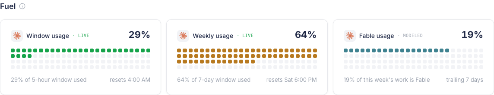

Wider and shorter, and still one square per whole percent — asserted, not
eyeballed: `GAUGE GRID {"cols":25,"squares":100}` from the computed
`grid-template-columns`, at both widths.

## 2 · The Claude mark

`250px_Claude_AI_symbol.svg.webp` moved off the repo root to
**`public/brand/claude-mark.webp`**. This repo had no `public/` directory before
now — marketing imagery lives in the blob store — so that directory is new.

**No vector is needed, and I measured rather than guessed.** The mark renders in
an 18px box; at DPR 3 that is 54 device pixels drawn from a 250px source, so it
is a downscale in every realistic case. Rendered at 3× it is clean:

All three cards carry it (`GAUGE ICONS 3`) — the founder's read is right that
one identity beats three, since every reading on that row is Claude's own
consumption.

## 3 · Insurers

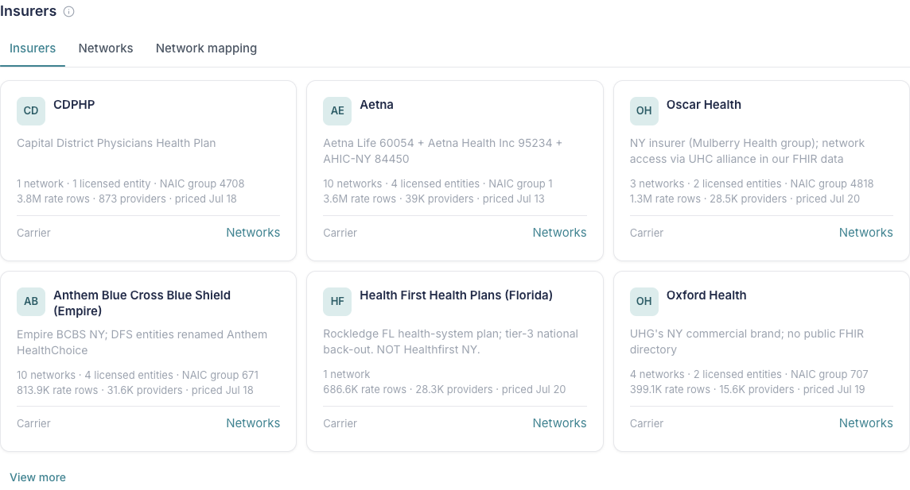

Last section on the page, 48 real rows from `insurers`, three tabs, 3×2 + View
more. Card anatomy: monogram mark + name, the registry's own note as the
description, the metadata that row actually has, one action at the foot.

**Where every value comes from.** `insurers.name` / `kind` / `naic_group_code` /
`notes`; parent name self-joined on `parent_id`; network count from `networks`;
licensed-entity count from `insurer_companies`; rate rows, providers and
priced-date summed from the **`payer_rate_totals` matview** through
`insurer_aliases`. Nothing is scored, ranked or estimated.

**Thin rows show thin.** 31 of 48 carry rates, 16 carry networks, 20 carry a
NAIC group, 27 carry a note. A row with none of that gets a derived one-liner
from the two columns we always have ("Carrier under Elevance Health") and a
`Registry only` foot — never filler prose.

**A measurement worth keeping:** the obvious query,
`SELECT DISTINCT payer FROM provider_rate_signals`, takes **27 seconds** against
13.7M rows. Through the matview the whole board is **~183ms**. I tried the
obvious one first and rejected it on the clock.

No carrier logos exist in this repo, so the mark slot is a monogram. A borrowed
logo would be the dishonest option.

## 4 · Data — seven tabs

| Objects | Indexes | Functions |
| --- | --- | --- |
| 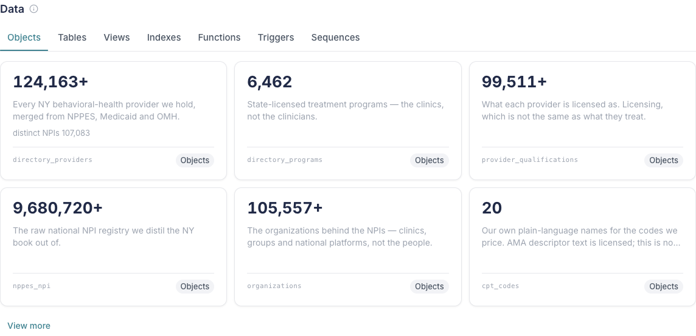 | 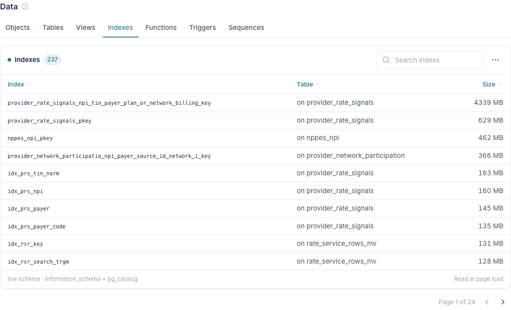 | 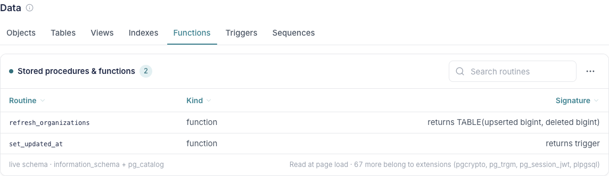 |

- Rich-text links **removed** — asserted per tab as `links=0` inside every card.
- Uniform card size — `h=[196] w=[373]` at 1440, `w=[320]` at 1280: one distinct
  height and one distinct width across the grid. Body clamps at two lines.
- Own tab rail + collapse, matching the other sections.
- **"Who exists (foundation)" → "Objects"** in `lib/table-atlas.mjs`.
- 3×2 + View more bottom-left.
- Six live-schema tabs, populated by introspection at page load.

**Cards vs tables, and why.** Objects is cards: every row carries a written
meaning, a count and a badge — that is a card's job. The six schema tabs are
tables: uniform name/detail/metric triples with nothing to describe, up to 237
of them. Cards there would be forty clicks of "View more" to read a list.

### What is actually in the database

| Tab | Count | Note |
| --- | --- | --- |
| Tables | 76 | row estimates from `reltuples`, carrying `+` |
| Views | 18 | 6 plain + 12 materialized, distinguished in a column |
| Indexes | 237 | sized, largest first — `provider_rate_signals` alone holds a 4,339 MB index |
| Stored procedures & functions | **2** | see the correction below |
| Triggers | **19** | see the correction below |
| Sequences | 1 | `audit_events_id_seq` |

## Verification (batch 2)

Headless Chromium, admin login, both widths, printed assertions:

| Claim | Evidence | 1440 | 1280 |
| --- | --- | --- | --- |
| Gauge is 25 × 4 = 100 squares | computed `cols:25, squares:100` | ✅ | ✅ |
| Claude mark on all three cards | `GAUGE ICONS 3` (matched on `img[src="/brand/claude-mark.webp"]`) | ✅ | ✅ |
| Insurers is last on the page | `H2 ORDER [… "Data","Insurers"]` | ✅ | ✅ |
| Insurers 3×2 + View more | `INS/Insurers: cards=6 vm=1` | ✅ | ✅ |
| Insurer cards uniform | `h=[228] w=[373]` / `w=[320]` | ✅ | ✅ |
| Networks tabs visible + honestly empty | `cards=0`, EmptyState quoting the 72 real rows | ✅ | ✅ |
| Data: no links in cards | `links=0` on every tab | ✅ | ✅ |
| Data: Objects uniform + 3×2 + View more | `cards=6 vm=1 h=[196] w=[373]` | ✅ | ✅ |
| Six schema tabs populated live | `rows=10/10/10/2/10/1` (paged) | ✅ | ✅ |
| Ten rows a page | `rows=10` where the set is larger | ✅ | ✅ |
| Workbench still intact | `WB/Agents=6 Reports=2 Rules=6` | ✅ | ✅ |
| Zero "Editable" badges | `EDITABLE_BADGES 0` | ✅ | ✅ |
| No horizontal scroll | `DOC H-SCROLL false` | ✅ | ✅ |
| One H1 | `H1S ["Workspace"]` | ✅ | ✅ |

`npx tsc --noEmit` clean. First paint 647–1,565ms with the two new query sets in
the page's `Promise.all`.

**The empty state was forced, not asserted.** Pointing the sequences query at a
schema that does not exist and letting HMR pick it up:

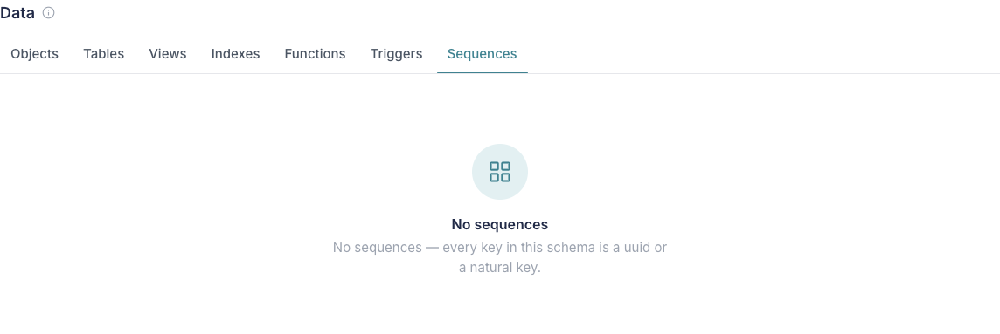

## Flags (batch 2)

**8. Premise correction — we DO have triggers: 19 of them.** The brief expected
none. `set_updated_at()` is wired onto 19 tables (appointments, clients,
invoices, forms, files, …). The tab lists them with the table and the function
each one calls.

**9. Premise correction — "69 stored procedures" is an illusion; we wrote 2.**
`information_schema.routines` reports 69 in `public`, but 67 belong to
extensions: pgcrypto (36), pg_trgm (31), pg_session_jwt (8), plpgsql (3). The
tab filters them out via `pg_depend` and reports **`refresh_organizations`** and
**`set_updated_at`** — then names the other 67 in its footer, so the gap between
the two numbers is explained on the surface rather than discovered later.

**10. Defect I introduced and fixed in the same session.** Rendering all 237
indexes made the Data section **~9,600px tall** and swallowed the page. The
schema tables now page at ten rows (the table standard's number). Worth
recording because the first version passed every count assertion while being
unusable — the assertions did not catch it, looking at the screenshot did.

**11. Tab 2 of Insurers could be populated today.** I built it as the briefed
placeholder, but `networks` holds **72 rows** and `payer_network_map` holds
**1,133**. Rather than ship a blank that implies we have nothing, the
placeholder states those counts — "72 rows already sit in the networks table —
this surface for them is the missing piece, not the data." Say the word and
tab 2 becomes real; the repo function is one query.

**12. Same monochrome-first-page effect as Rules.** The Objects tab's first six
cards all carry the `Objects` badge, because the curated groups are flattened in
order. Consistent with the choice I made for Rules in batch 1, and the same
alternative applies (interleave by group). Flagging it once for both.

**13. `docs/data/DATABASE.md` still says "Who exists (foundation)".** That file
is generated by `scripts/db-atlas.mjs` and owned by docs-agent, so I did not
regenerate it. It wants a rerun to pick up the rename.

**14. Data-section table standard, stated plainly.** The six schema tables ship
the full v2 anatomy — title + count pill far left, search right, sortable
columns, source + freshness footer, ten rows. They page **client-side**: the
largest set is 237 rows, and the server-pagination half of the lightning stack
is for the >10k tables. Saying so explicitly because the standing rule reads as
unconditional.

## Design-system position (batch 2)

**Still no new primitive.** Insurers is `Card` + `Tabs` + `TextLink` +
`EmptyState` + `Button`; Data is `Tabs` + `DataTable` + `SearchInput` +
`Pagination` + `EmptyState` + `Card` + `Badge` + `Tag` + the existing `CopyChip`
and `SchemaTree`. `components/ui/*` is untouched across both batches.

`observatory.tsx` is deleted — `data-panel.tsx` supersedes it, carrying its card
logic forward rather than running two inventory renderers.

Report appended. Not pushed. Stopping here.
